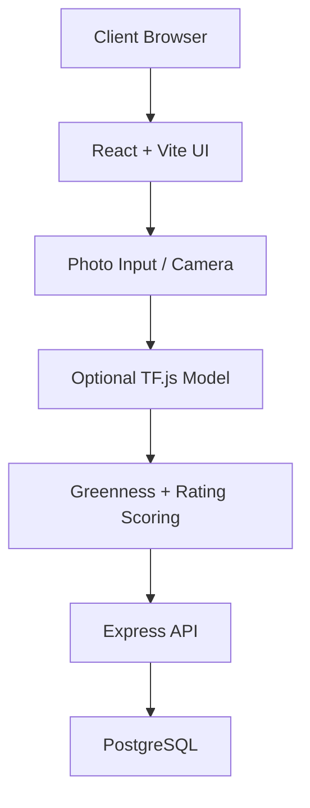
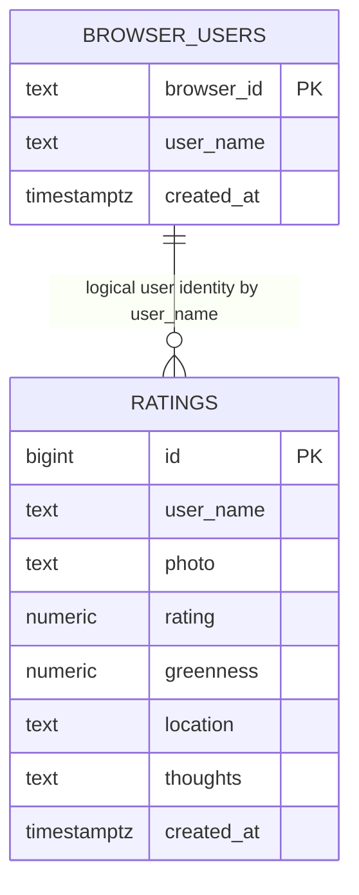

# Sip & Score - Matcha Log

React + TypeScript + Vite app for rating matcha with half-star support, tap-and-drag star input, camera capture, optional ML drink-area detection, friend lookups, and Explore rankings.

<details open>
<summary><strong>Technical Design</strong></summary>

This project uses a split frontend/backend architecture.

- Frontend: React + TypeScript SPA (`src/App.tsx`) built with Vite.
- Backend: Express API (`server/index.js`) serving JSON endpoints.
- Data: PostgreSQL via `pg` pool (`server/db.js`).
- ML assist: Optional TensorFlow.js model in `public/ml/drink-area/model.json` for drink-area segmentation before greenness scoring.
- Monitoring: Free Sentry tier for frontend + backend crash monitoring and release tracking.
- Release tagging: GitHub Releases should include a version tag like `v1.0.0` and match the app release value used in Sentry.
- Scoring:
  - Entry total score (out of 200): `rating * 20 + greennessWeight * greenness`
  - `greennessWeight = 1.0` when rating is `4.0/5` or higher, otherwise `0.8`
  - Greenness is stored and displayed to one decimal place.
  - Explore place ranking: average score out of 200 across entries for each normalized place.



</details>

<details open>
<summary><strong>System Design</strong></summary>

### Runtime Components

- `src/App.tsx`: page tabs (`My Log`, `Friends Ratings`, `Explore`), rating creation/edit/delete, tap-and-drag star input, search, and overlays.
- `server/index.js`: REST routes for sessions, ratings CRUD, friend search/lookups, explore places, and explore users.
- `server/db.js`: DB pool + schema initialization.

### Database Relations



Notes:
- The relationship is logical (by user name), not enforced as a SQL foreign key.
- Explore endpoints normalize and merge similar place names before aggregation, including spacing, punctuation, and location variants.

</details>

<details open>
<summary><strong>API Calls</strong></summary>

Base path: `/api`

### Health and Session

- `GET /health`
  - Response: `{ ok: true }`
- `POST /users/session`
  - Body: `{ browserId, userName? }`
  - Response: `{ requiresName, userName? }`

### Ratings

- `POST /ratings`
  - Body: `{ userName, photo, rating, greenness, location, thoughts }`
  - Response: `{ rating }`
- `GET /ratings?userName=<name>`
  - Response: `{ ratings: RatingEntry[] }`
- `PUT /ratings/:id`
  - Body: `{ userName, rating, location, thoughts, greenness? }`
  - Response: `{ rating }`
- `DELETE /ratings/:id?userName=<name>`
  - Response: `{ deletedId }`

### Friends

- `GET /friends/search?q=<partialName>`
  - Response: `{ friends: string[] }`
- `GET /friends/:friendName/ratings`
  - Response: `{ friendName, ratings: RatingEntry[] }`

### Explore

- `GET /explore/places?limit=10`
  - Response: `{ places: [{ rank, placeName, averageScore, entryCount }] }`
- `GET /explore/places/:placeName/ratings`
  - Response: `{ placeName, ratings: RatingEntry[] }`
- `GET /explore/users?limit=50`
  - Response: `{ users: [{ userName, placeCount }] }`

</details>

<details>
<summary><strong>Local Development</strong></summary>

1. Install dependencies:

```bash
npm install
```

2. Copy env template and set DB connection:

```bash
copy .env.example .env
```

3. Start frontend + backend:

```bash
npm run dev:full
```

4. Open the Vite URL (usually `http://localhost:5173`).

Optional split runs:

```bash
npm run dev
npm run server
```

</details>

<details>
<summary><strong>Build and Deploy</strong></summary>

Build:

```bash
npm run build
```

Preview:

```bash
npm run preview
```

GitHub Pages deploys from `main` via GitHub Actions.

</details>

<details open>
<summary><strong>FAQ (Top 7)</strong></summary>

### 1) How does the app know a new user is registering?
The app sends `browserId` to `POST /api/users/session`. If no existing `browser_users` row exists for that browser and no name is provided, API returns `requiresName: true`, and the UI prompts for a name.

### 2) How are scores calculated?
Per entry: `rating * 20 + greennessWeight * greenness`.

- If the rating is `4.0/5` or higher, greenness counts at full value.
- If the rating is below `4.0/5`, greenness is discounted to `0.8x`.
- Greenness is saved to one decimal place.
- `0`-star ratings are always pushed to the bottom of rankings, and then sorted by greenness within that `0`-star group.

Explore place rankings use the average score out of 200 for each merged place.

### 3) How do the top 10 places in Explore get ranked?
Places are ranked by average score out of 200 across all user ratings. Duplicate entries for the same place are merged dynamically before ranking, including variants caused by punctuation, spacing, or appended city/location text. Results then sort highest to lowest by average score.

### 4) Can I click a place in Explore to see all ratings for it?
Yes. Click any place card in the `Top Places` list to open a popup modal with all ratings matched to that place (including merged name/location variants). Use the `X` button in the top-right of the popup to close it.

### 5) Is the camera always required?
No. You can upload from photo roll or capture live. After a photo is chosen/captured, live camera access is stopped.

### 6) How do star ratings work in the UI?
Ratings support half-stars and `0` stars. You can tap a star or press and drag across the star row in both the new-entry form and the edit-entry form.

### 7) Why must each username be unique?
The `browser_users` table enforces a UNIQUE constraint on `user_name`, so each username belongs to exactly one user. This prevents confusion in Friends search, keeps ratings correctly attributed, and ensures the app maintains a trustworthy social network.

</details>
