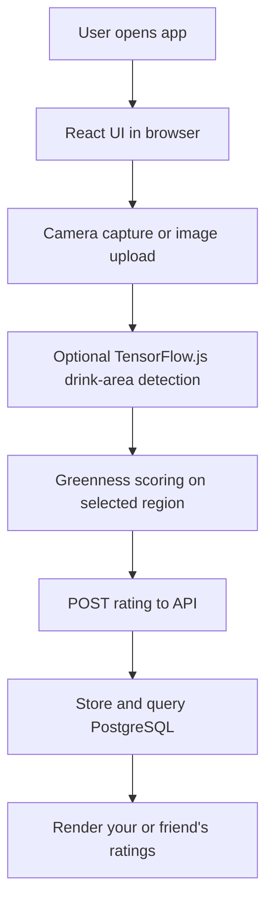

# Sip & Score - Matcha Log

React + TypeScript + Vite app for rating matcha with half-star support, camera capture, and optional ML drink-area detection.

## Technical Architecture

This app is a React + TypeScript frontend with a lightweight Express API backed by PostgreSQL. The UI runs in the browser, ratings are persisted in Postgres, and optional TensorFlow.js inference estimates drink regions before greenness scoring.



### System Design

- Presentation layer: React components in `src/App.tsx` and global styles in `src/App.css` and `src/index.css`.
- Image pipeline: camera capture or file upload produces a data URL, which is analyzed for matcha greenness.
- ML layer: TensorFlow.js loads an optional drink-area model from `public/ml/drink-area/model.json`; if it is missing, the app falls back to a heuristic mask.
- API layer: Node.js + Express endpoints in `server/index.js` provide session user, save rating, and friend search/query operations.
- Persistence layer: PostgreSQL tables (`browser_users`, `ratings`) store browser-to-user mapping and all rating logs.
- Deployment layer: Vite builds the app into `dist`, and GitHub Actions publishes it to GitHub Pages on each push to `main`.

## Local Development

1. Install dependencies:
   ```bash
   npm install
   ```
2. Copy environment template and set your Postgres connection:
   ```bash
   copy .env.example .env
   ```
3. Start frontend + API together:
   ```bash
   npm run dev:full
   ```
4. Open the local URL printed by Vite, usually `http://localhost:5173`.

If you only want frontend or backend individually:

```bash
npm run dev      # frontend only
npm run server   # backend API only
```

## Production Build

```bash
npm run build
```

To preview the production build locally:

```bash
npm run preview
```

## GitHub Pages Deployment

This repo is configured to deploy automatically to GitHub Pages from the `main` branch with GitHub Actions.

One-time setup in GitHub:
1. Open the repository settings.
2. Go to `Pages`.
3. Set `Build and deployment` to `GitHub Actions`.
4. Push a commit to `main` or run the workflow manually from the `Actions` tab.

What happens after that:
- Every push to `main` runs `npm ci` and `npm run build`.
- The `dist` folder is published to GitHub Pages automatically.
- The Vite base path is adjusted during the GitHub Actions build so public assets and the ML model load correctly on Pages.

If your repository name is not `matchaRatings`, update the base path in [vite.config.ts](vite.config.ts) and the asset paths in [src/App.tsx](src/App.tsx) to match your repo name.
