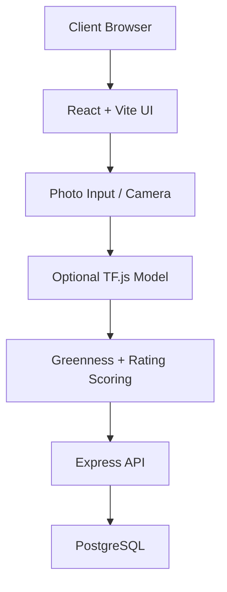
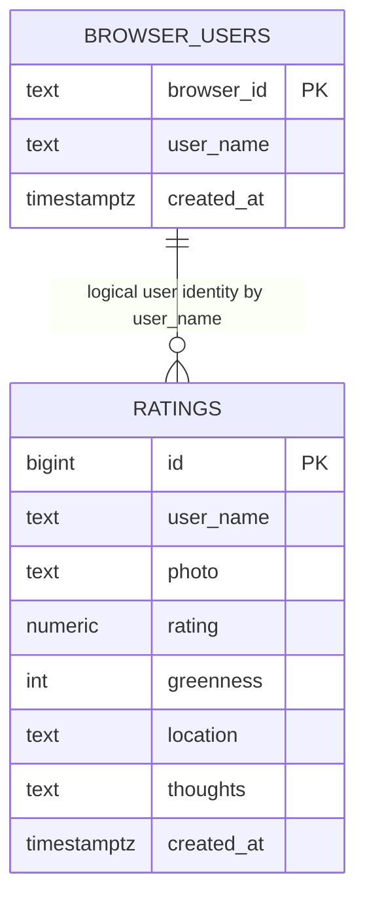

# Sip & Score - Matcha Log

React + TypeScript + Vite app for rating matcha with half-star support, camera capture, optional ML drink-area detection, friend lookups, and Explore rankings.

<details open>
<summary><strong>Technical Design</strong></summary>

This project uses a split frontend/backend architecture.

- Frontend: React + TypeScript SPA (`src/App.tsx`) built with Vite.
- Backend: Express API (`server/index.js`) serving JSON endpoints.
- Data: PostgreSQL via `pg` pool (`server/db.js`).
- ML assist: Optional TensorFlow.js model in `public/ml/drink-area/model.json` for drink-area segmentation before greenness scoring.
- Scoring:
  - Entry total score (out of 200): `rating * 20 + greenness`
  - Explore place ranking: average score out of 200 across entries for each normalized place.



</details>

<details open>
<summary><strong>System Design</strong></summary>

### Runtime Components

- `src/App.tsx`: page tabs (`My Log`, `Friends Ratings`, `Explore`), rating creation/edit/delete, search, and overlays.
- `server/index.js`: REST routes for sessions, ratings CRUD, friend search/lookups, explore places, and explore users.
- `server/db.js`: DB pool + schema initialization.

### Database Relations



Notes:
- The relationship is logical (by user name), not enforced as a SQL foreign key.
- Explore endpoints normalize place names before aggregation (for example, Bonito + Bonito Cafe).

</details>

<details open>
<summary><strong>API Calls</strong></summary>

Base path: `/api`

### Health and Session

- `GET /health`
  - Response: `{ ok: true }`
- `POST /users/session`
  - Body: `{ browserId, userName? }`
  - Response: `{ requiresName, userName? }`

### Ratings

- `POST /ratings`
  - Body: `{ userName, photo, rating, greenness, location, thoughts }`
  - Response: `{ rating }`
- `GET /ratings?userName=<name>`
  - Response: `{ ratings: RatingEntry[] }`
- `PUT /ratings/:id`
  - Body: `{ userName, rating, location, thoughts }`
  - Response: `{ rating }`
- `DELETE /ratings/:id?userName=<name>`
  - Response: `{ deletedId }`

### Friends

- `GET /friends/search?q=<partialName>`
  - Response: `{ friends: string[] }`
- `GET /friends/:friendName/ratings`
  - Response: `{ friendName, ratings: RatingEntry[] }`

### Explore

- `GET /explore/places?limit=10`
  - Response: `{ places: [{ rank, placeName, averageScore, entryCount }] }`
- `GET /explore/users?limit=50`
  - Response: `{ users: [{ userName, placeCount }] }`

</details>

<details>
<summary><strong>Local Development</strong></summary>

1. Install dependencies:

```bash
npm install
```

2. Copy env template and set DB connection:

```bash
copy .env.example .env
```

3. Start frontend + backend:

```bash
npm run dev:full
```

4. Open the Vite URL (usually `http://localhost:5173`).

Optional split runs:

```bash
npm run dev
npm run server
```

</details>

<details>
<summary><strong>Build and Deploy</strong></summary>

Build:

```bash
npm run build
```

Preview:

```bash
npm run preview
```

GitHub Pages deploys from `main` via GitHub Actions.

</details>

<details open>
<summary><strong>FAQ (Top 5)</strong></summary>

### 1) How does the app know a new user is registering?
The app sends `browserId` to `POST /api/users/session`. If no existing `browser_users` row exists for that browser and no name is provided, API returns `requiresName: true`, and the UI prompts for a name.

### 2) How are scores calculated?
Per entry: `rating * 20 + greenness` (0 to 200). Explore place rankings use average score out of 200 for each normalized place.

### 3) Why are some place names merged in Explore?
Normalization combines known naming variants so rankings are cleaner, such as Bonito + Bonito Cafe and Nana's + Nana's Green.

### 4) Is the camera always required?
No. You can upload from photo roll or capture live. After a photo is chosen/captured, live camera access is stopped.

### 5) Why can two users share the same displayed name?
Current schema stores `user_name` as text and does not enforce global uniqueness. Session mapping is browser-based via `browser_id`.

</details>
