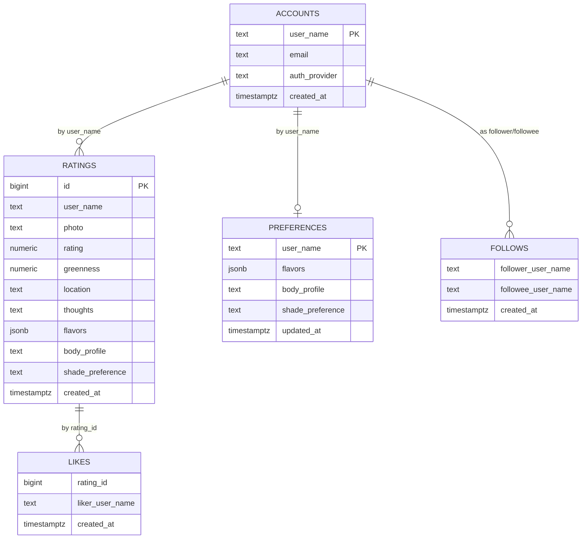

# 🍵 Sip & Score — the matcha rating app

> Rate every matcha you sip. Watch your map fill in. Meet the people who
> sip like you.

A React + TypeScript PWA with an Express + PostgreSQL backend, a custom
TensorFlow.js drink-area segmentation model, 16 tea-themed palate
archetypes, and social discovery. Ships as an installable app on iOS,
Android, and desktop.

**🔗 Live:** [allyyim.github.io/matchaRatings](https://allyyim.github.io/matchaRatings/)
&nbsp;·&nbsp; **📦 Frontend:** GitHub Pages
&nbsp;·&nbsp; **🖥️ Backend:** Render
&nbsp;·&nbsp; **🗄️ DB:** PostgreSQL

---

## 📖 Glossary

Jump straight to the section you care about.

| Topic | Section |
| --- | --- |
| Why this exists | [Problem & Opportunity](#-problem--opportunity) |
| What the app does at a glance | [Overview](#-overview) |
| Palate archetypes (the tea-themed personality quiz) | [Palate System](#-palate-system) |
| Flavor vocabulary + descriptors | [Flavor Language](#-flavor-language) |
| How the ML greenness score works | [ML - Drink-Area Segmentation](#-ml--drink-area-segmentation) |
| Sip Score formula | [Sip Score](#-sip-score) |
| Frontend tech + file map | [Frontend](#-frontend) |
| Backend architecture | [Backend](#-backend) |
| Full API reference | [API Reference](#-api-reference) |
| Database schema | [Database](#-database) |
| PWA + offline behavior | [PWA & Offline](#-pwa--offline) |
| Rate limits, sanitization, headers | [Security](#-security) |
| Bundle splits, caching, motion tokens | [Performance](#-performance) |
| File tree | [File Map](#-file-map) |

---

## 💡 Problem & Opportunity

<details open>
<summary><strong>Matcha drinkers have nowhere to rate the matcha itself</strong></summary>

Yelp cares about the café. Beli cares about the meal. Neither cares
about the cup.

Matcha is a category that lives *inside* other categories on every
existing app: it's a drink on a menu at a coffee shop on a review
platform. That means the actual thing a matcha drinker cares about —
the experience, the shade, the umami, the mouthfeel — is invisible.

Sip & Score is the missing layer. Rate the sip, not the store. Track
your palate over time. Find the people whose taste actually maps to
yours, and the places whose matcha (not their oat milk latte) is worth
the trip.

</details>

---

## 🌱 Overview

<details open>
<summary><strong>What Sip & Score is (and isn't)</strong></summary>

Sip & Score is a personal + social matcha log. Every sip you log gets:

- ⭐ A star rating (half-stars, tap-and-drag)
- 📸 A photo (camera or upload) auto-scored for greenness by an on-device ML model
- 🌿 Optional flavor picks + body profile + shade preference
- ✨ A single **Sip Score** out of 100 combining taste + look

You get a growing personal log, a Feed of friends' sips + milestones,
an Explore leaderboard of top places and top sippers, and a
tea-themed palate archetype (like *The Purist*, *The Cloud Whisker*,
*The Foam Chaser*) that updates as your flavor picks evolve.

**Non-goals:** matcha grade certification, chemistry testing, café
reviews for non-matcha drinks.

</details>

---

## 🎭 Palate System

<details>
<summary><strong>16 tea-themed archetypes with per-archetype pastel chips</strong></summary>

Every user's flavor picks are clustered into 5 families:

| Cluster | Flavors |
| --- | --- |
| 🟤 **dessert** | chocolatey, nutty, velvety, rich |
| 🌸 **sweet** | sweet, sugary, creamy, floral |
| 🌿 **earthy** | earthy, vegetal, grassy, umami |
| 🌾 **bracing** | astringent, bitter |
| 💧 **silky** | mellow, bold |

Then classified into one of **16 archetypes**, each with its own
distinct pastel chip color:

**Solo (single dominant cluster):**
- 🟤 The Dessert Sipper &nbsp;·&nbsp; 🌸 The Creamy Dreamer &nbsp;·&nbsp; 🌿 The Purist &nbsp;·&nbsp; 🌾 The Grown-Up &nbsp;·&nbsp; 💧 The Smooth Operator

**Combo (two competitive clusters):**
- The Wagashi Pair (dessert+sweet) &nbsp;·&nbsp; The Hojicha Head (dessert+earthy) &nbsp;·&nbsp; The Koicha Kid (dessert+bracing) &nbsp;·&nbsp; The Latte Artist (dessert+silky)
- The Meadow Sipper (sweet+earthy) &nbsp;·&nbsp; The Yuzu Sipper (sweet+bracing) &nbsp;·&nbsp; The Foam Chaser (sweet+silky)
- The Stone Milled (earthy+bracing) &nbsp;·&nbsp; The Zen Master (earthy+silky) &nbsp;·&nbsp; The Gyokuro (bracing+silky)

**Balanced (3+ close clusters):**
- The Cloud Whisker

All logic lives in [`src/lib/palateSummary.ts`](./src/lib/palateSummary.ts) —
`palateArchetype()` returns the label, `palateArchetypePaletteFor()`
returns the per-archetype pastel. Server never filters flavors so
the same input always produces the same archetype across the
leaderboard chip, similar-users recs card, and friend modal.

</details>

---

## 🌿 Flavor Language

<details>
<summary><strong>Matcha-specific descriptors + info tooltips</strong></summary>

Each flavor bubble has a hand-written, matcha-voice descriptor that
appears when the user taps the ⓘ icon in the new-log modal:

| Flavor | Descriptor |
| --- | --- |
| chocolatey | Cocoa-like depth — dark, roasty sweetness. |
| nutty | Toasted almond or hazelnut warmth. |
| velvety | Luxurious, cloud-like microfoam texture. |
| rich | Bold and full-flavored — matcha-forward. |
| earthy | Grounded and mineral. |
| vegetal | Fresh spinach, raw green notes. |
| grassy | Fresh-cut lawn, springtime green. |
| umami | Savory, brothy, seaweed-like depth. |
| astringent | Puckering, dry mouthfeel. |
| bitter | Sharp, dry and pungent. |
| mellow | Smooth and no bitterness. |
| bold | Strong, matcha-forward finish — makes itself known. |

Full source: [`src/lib/flavors.ts`](./src/lib/flavors.ts).

</details>

---

## 🤖 ML - Drink-Area Segmentation

<details>
<summary><strong>Custom TensorFlow.js model that masks the drink before scoring</strong></summary>

### What the model does
A lightweight image segmentation model whose job is to answer:
*"Which pixels in this image are the drink?"*

Without a mask, the greenness score can accidentally count green
background, shadows, or table surfaces. The model narrows the
calculation to the actual drink region.

### Technical details
- **Framework:** TensorFlow.js (browser)
- **Format:** `model.json` + weight shards in [`public/ml/drink-area/`](./public/ml/drink-area/)
- **Input:** RGB image resized to 224 × 224
- **Output:** 2D heatmap; values > `0.45` are treated as drink pixels
- **Loading:** `tf.loadGraphModel()` first, falls back to `tf.loadLayersModel()`
- **Fallback mode:** if the model is missing or fails, the app uses a
  heuristic circular mask centered on the image so ratings still save

### Pipeline
1. User uploads or captures an image
2. App downscales for performance
3. Image → drink-area model → binary mask
4. Greenness runs only inside the mask
5. Combined with the star rating → final Sip Score

</details>

---

## ✨ Sip Score

<details>
<summary><strong>How the single number out of 100 is calculated</strong></summary>

- **Entry raw score (out of 200):** `rating × 20 + greennessWeight × greenness`
- **`greennessWeight`:** `1.0` when `rating ≥ 4.0/5`, else `0.8`
- **Greenness:** ML-scored 0–100, stored + displayed to 1 decimal
- **Explore place ranking:** average score across entries for each
  normalized place name

Bands users see:
- 🟢 **85+** — a stunner
- 🟢 **70–84** — solid sip
- 🟡 **Below 70** — noted

</details>

---

## 🖥 Frontend

<details>
<summary><strong>React + TypeScript + Vite SPA, PWA-installable</strong></summary>

### Stack
- **React 18** + **TypeScript** + **Vite**
- **React lazy chunks** for Feed, Explore, Onboarding, Google OAuth
- **Sentry** frontend crash monitoring
- **PWA** via `public/service-worker.js` + `public/manifest.webmanifest`
- **Motion tokens** (`--motion-fast/base/slow`, `--ease-out/in-out/spring`)
  on `:root` so animation timing is consistent app-wide
- **`__DEV__` compile-time constant** via Vite `define` — strips
  `console.log` at build

### Key files
| Path | Role |
| --- | --- |
| [`src/App.tsx`](./src/App.tsx) | Top-level shell, tab routing, modals |
| [`src/lib/api.ts`](./src/lib/api.ts) | `apiFetch` + auth token + 429 `onRateLimited` pub/sub |
| [`src/lib/palateSummary.ts`](./src/lib/palateSummary.ts) | Archetype logic + 16 pastel palettes |
| [`src/lib/flavors.ts`](./src/lib/flavors.ts) | Flavor list, cluster map, descriptors |
| [`src/lib/PalateChip.tsx`](./src/lib/PalateChip.tsx) | The archetype chip component |
| [`src/features/OnboardingSlides.tsx`](./src/features/OnboardingSlides.tsx) | 6-slide onboarding (replayable) |
| [`src/features/FeedPage.tsx`](./src/features/FeedPage.tsx) | Feed tab |
| [`src/features/ExplorePage.tsx`](./src/features/ExplorePage.tsx) | Explore + Leaderboard |
| [`src/hooks/useSession.ts`](./src/hooks/useSession.ts) | Auth session state |
| [`src/hooks/usePreferences.ts`](./src/hooks/usePreferences.ts) | Palate prefs read/write |

</details>

---

## 🌐 Backend

<details>
<summary><strong>Express + PostgreSQL on Render</strong></summary>

### Architecture
```
Client (GitHub Pages) ──HTTPS──► Express API (Render) ──pg pool──► PostgreSQL
                                       │
                                       ├─ Rate limiters (auth 5/min, recs 40/min, global 120/min)
                                       ├─ CORS + security headers (X-Content-Type-Options, X-Frame-Options, ...)
                                       ├─ JWT-ish session tokens
                                       └─ In-process recsCache (5-min TTL, 500 entry LRU cap)
```

### Key files
| Path | Role |
| --- | --- |
| [`server/index.js`](./server/index.js) | All routes, rate limiters, recsCache, auth |
| [`server/db.js`](./server/db.js) | pg pool + schema init |

</details>

---

## 🔌 API Reference

<details>
<summary><strong>Full endpoint list</strong> (base path <code>/api</code>)</summary>

### Health
- `GET /health` → `{ ok: true }`

### Auth
> 🔒 The starred endpoints below use the strict **auth limiter** (5 req/min per IP).

- `POST /auth/request-link` * — magic-link email
- `POST /auth/verify` * — verify magic link
- `POST /auth/google/verify` * — Google OAuth
- `POST /auth/verify-account` * — check account exists
- `POST /auth/google/confirm-account` * — finalize Google signup
- `POST /auth/demo` * — spin up demo account
- `POST /auth/link-email` * — link email to session
- `POST /users/session` * — establish session
- `GET  /auth/link-status`
- `GET  /auth/check-username`

### Ratings
- `POST /ratings` — create
- `GET  /ratings?userName=<name>` — list mine
- `PUT  /ratings/:id` — edit
- `DELETE /ratings/:id?userName=<name>` — remove
- `POST /ratings/:id/like` / `DELETE /ratings/:id/like` — Feed likes

### Friends + follows
- `GET /friends/search?q=<partial>`
- `GET /friends/:friendName/ratings`
- `POST /follows` / `DELETE /follows`
- `GET /follows?userName=<name>`

### Preferences
- `GET  /users/:userName/preferences` — un-cached (SW bypass)
- `PUT  /users/:userName/preferences`

### Explore + recs
> 🔒 Use the **recs limiter** (40 req/min per IP).

- `GET /explore/places?limit=10`
- `GET /explore/places/:placeName/ratings`
- `GET /explore/users?limit=50` — leaderboard (un-cached in SW)
- `GET /similar-users?userName=<name>` — "People like you" (un-cached in SW)
- `GET /users/similar-preferences`
- `GET /explore/similar-places`

### Feed
- `GET /feed?userName=<name>` — milestones + follows + palate picks

</details>

---

## 🗄 Database

<details>
<summary><strong>PostgreSQL schema (logical FKs by user_name)</strong></summary>



**Notes:**
- Relationships are logical (`user_name`), not enforced as SQL FKs
- Explore normalizes place names (spacing/punctuation/location) before aggregation
- `flavors` is JSONB — stored as an array of strings

</details>

---

## 📱 PWA & Offline

<details>
<summary><strong>Service worker strategy + install support</strong></summary>

- **Precache:** app shell + assets tagged by git SHA on deploy
- **Network-first** for `/api/*` with 3s timeout → falls back to cache
- **Always-network** for identity endpoints so chips never go stale:
  - `/api/users/*/preferences`
  - `/api/similar-users`
  - `/api/explore/users`
- **iOS install modal** with step-by-step Add to Home Screen guide
- **Chrome/Android:** native `beforeinstallprompt` capture

Manifest: [`public/manifest.webmanifest`](./public/manifest.webmanifest)
Worker: [`public/service-worker.js`](./public/service-worker.js)

</details>

---

## 🔐 Security

<details>
<summary><strong>Rate limits, sanitization, headers, CORS</strong></summary>

### Rate limits (per IP)
| Tier | Limit | Endpoints |
| --- | --- | --- |
| Auth | **5 req/min** | All `/auth/*` mutating + `/users/session` |
| Recs | **40 req/min** | `/similar-users`, `/similar-preferences`, `/explore/users` |
| Global | **120 req/min** | Everything else under `/api` |

Client-side: `apiFetch` emits an `onRateLimited` event on any 429;
`App.tsx` renders a single 4-second pill toast instead of every failing
call surfacing its own error.

### Sanitization
- `sanitizeUserName()` on every user-supplied name
- `express.json({ limit: '15mb' })` guards against payload attacks
- Server never returns raw error bodies containing `{` or `<`
- Client caps server-passthrough messages at 200 chars

### Headers
- `X-Content-Type-Options: nosniff`
- `X-Frame-Options: DENY`
- `Referrer-Policy: strict-origin-when-cross-origin`
- `X-XSS-Protection: 0`
- `x-powered-by` disabled

### CORS
Origin allowlist enforced in `server/index.js`:

- `https://allyyim.github.io` (production frontend)
- `http://localhost:5173` / `http://127.0.0.1:5173` (Vite dev)
- `http://localhost:4173` / `http://127.0.0.1:4173` (Vite preview)
- `http://localhost:3001` / `http://127.0.0.1:3001` (same-origin API)

Extend via the `CORS_ORIGINS` env var (comma-separated) to add staging
or custom-domain origins without a code change. `credentials: true`.

### Auth
- Bearer token via `Authorization` header
- CSRF token via `X-CSRF-Token` when present
- Ownership check middleware: session user must match `userName` param
  or the request 403s

</details>

---

## ⚡ Performance

<details>
<summary><strong>Bundle splits, caching, motion tokens</strong></summary>

### Bundle
- `react-vendor` split → 366 kB → **111 kB gzip**
- Feature chunks: `FeedPage`, `ExplorePage`, `OnboardingSlides`,
  `google-oauth` (all lazy)
- Main `index` chunk ~46 kB gzip

### Caching layers
| Layer | TTL / policy |
| --- | --- |
| SW static | Precache by git SHA, cleared on deploy |
| SW `/api/*` | Network-first, 3s timeout, cache fallback |
| SW identity endpoints | **Never cache** (`isUncachedApi()`) |
| Client friend-modal | `?_v=<nonce>` cache-buster on every open |
| Server recs | In-process `Map`, 5-min TTL, 500 entry cap, `v2` key suffix |

### Runtime
- Motion tokens centralize animation timing so components share
  transitions without duplicating cubic-beziers
- `__DEV__` compile-time constant strips `console.log` in prod
- ML model is loaded lazily on first photo capture, not app boot

</details>

---

## 🗂 File Map

<details>
<summary><strong>Where the important stuff lives</strong></summary>

```
matchaRatings/
├── src/
│   ├── App.tsx                     ← shell, tabs, modals
│   ├── App.css                     ← all styles
│   ├── features/
│   │   ├── OnboardingSlides.tsx    ← 6-slide onboarding
│   │   ├── FeedPage.tsx            ← Feed tab
│   │   └── ExplorePage.tsx         ← Explore + Leaderboard
│   ├── lib/
│   │   ├── api.ts                  ← apiFetch + onRateLimited
│   │   ├── palateSummary.ts        ← archetype logic + palettes
│   │   ├── flavors.ts              ← flavor vocabulary
│   │   ├── PalateChip.tsx          ← archetype chip
│   │   └── cache.ts                ← client localStorage cache
│   └── hooks/
│       ├── useSession.ts
│       └── usePreferences.ts
├── server/
│   ├── index.js                    ← Express app, routes, limits
│   └── db.js                       ← pg pool + schema init
├── public/
│   ├── service-worker.js           ← SW + isUncachedApi()
│   ├── manifest.webmanifest
│   └── ml/drink-area/              ← TF.js segmentation model
├── .github/workflows/deploy.yml
├── vite.config.ts
└── README.md
```

</details>

---

Made with 🍵 by [@allyyim](https://github.com/allyyim). Questions? Open
an issue or DM.
