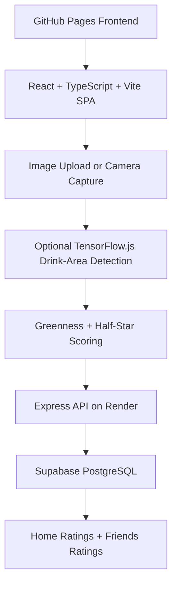

# Sip & Score - Matcha Log

React + TypeScript + Vite app for rating matcha with half-star support, camera capture, and optional ML drink-area detection.

## Technical Architecture

This project uses a split frontend/backend architecture. The frontend is a React + TypeScript SPA built with Vite and hosted on GitHub Pages. The backend is an Express API hosted on Render and connected to Supabase PostgreSQL via a pooled connection string. Optional TensorFlow.js inference runs in the browser to detect drink regions before greenness scoring.



### System Design

- Frontend layer: `src/App.tsx` renders the main app and Friends Ratings page, while `src/App.css` and `src/index.css` provide responsive styling.
- Client scoring pipeline: camera capture or file upload generates an image payload; optional TensorFlow.js model inference (`public/ml/drink-area/model.json`) narrows the drink region before greenness scoring.
- API layer: `server/index.js` exposes REST endpoints for health checks, browser-to-user session mapping, rating creation, personal rating retrieval, friend search, and friend ranking retrieval.
- Data layer: `server/db.js` initializes and connects to PostgreSQL tables (`browser_users`, `ratings`) and indexes query paths used by ratings and friend lookup.
- Ranking logic: friend logs are ordered by a combined score formula `(rating * 20 + greenness)` to blend star rating and color quality.
- Deployment layer: GitHub Actions builds and deploys the SPA to GitHub Pages, and production API traffic is routed via `VITE_API_BASE_URL` to the Render-hosted backend.

## Local Development

1. Install dependencies:
   ```bash
   npm install
   ```
2. Copy environment template and set your Postgres connection:
   ```bash
   copy .env.example .env
   ```
3. Start frontend + API together:
   ```bash
   npm run dev:full
   ```
4. Open the local URL printed by Vite, usually `http://localhost:5173`.

If you only want frontend or backend individually:

```bash
npm run dev      # frontend only
npm run server   # backend API only
```

## Production Build

```bash
npm run build
```

To preview the production build locally:

```bash
npm run preview
```

## GitHub Pages Deployment

This repo is configured to deploy automatically to GitHub Pages from the `main` branch with GitHub Actions.

One-time setup in GitHub:
1. Open the repository settings.
2. Go to `Pages`.
3. Set `Build and deployment` to `GitHub Actions`.
4. Push a commit to `main` or run the workflow manually from the `Actions` tab.

What happens after that:
- Every push to `main` runs `npm ci` and `npm run build`.
- The `dist` folder is published to GitHub Pages automatically.
- The Vite base path is adjusted during the GitHub Actions build so public assets and the ML model load correctly on Pages.

If your repository name is not `matchaRatings`, update the base path in [vite.config.ts](vite.config.ts) and the asset paths in [src/App.tsx](src/App.tsx) to match your repo name.
