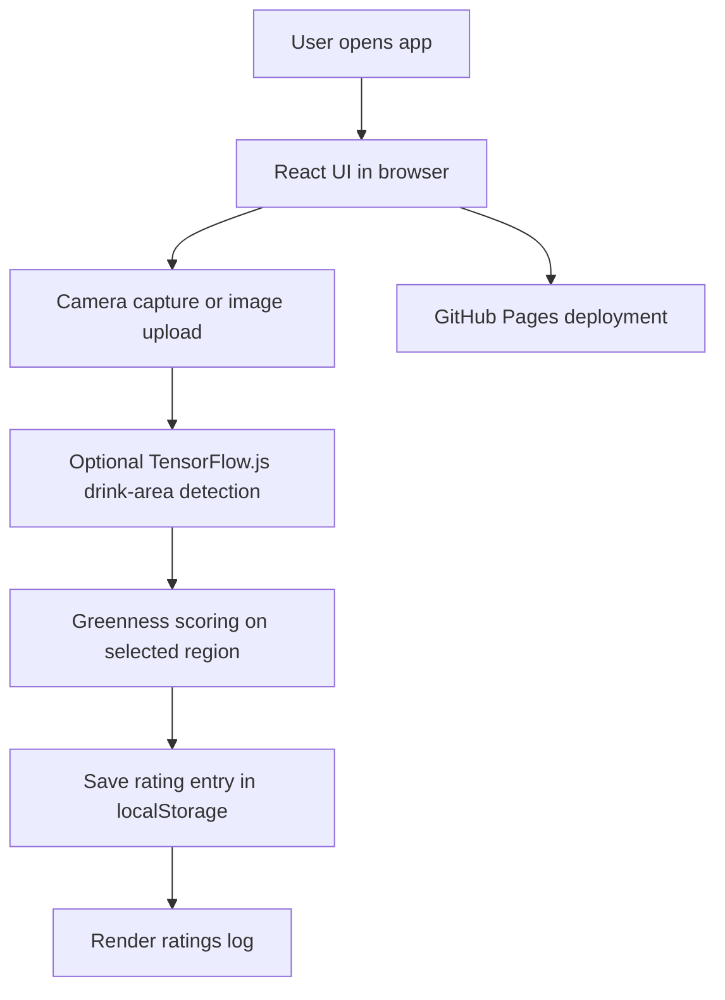

# Sip & Score - Matcha Log

React + TypeScript + Vite app for rating matcha with half-star support, camera capture, and optional ML drink-area detection.

## Technical Architecture

This app is a client-side React single-page application built with Vite and TypeScript. The UI is rendered in the browser, the rating log is stored locally in `localStorage`, and optional TensorFlow.js inference is used to estimate the drink region before greenness scoring runs.



### System Design

- Presentation layer: React components in `src/App.tsx` and global styles in `src/App.css` and `src/index.css`.
- Image pipeline: camera capture or file upload produces a data URL, which is analyzed for matcha greenness.
- ML layer: TensorFlow.js loads an optional drink-area model from `public/ml/drink-area/model.json`; if it is missing, the app falls back to a heuristic mask.
- Persistence layer: ratings, photos, and notes are stored in browser `localStorage`.
- Deployment layer: Vite builds the app into `dist`, and GitHub Actions publishes it to GitHub Pages on each push to `main`.

## Local Development

1. Install dependencies:
   ```bash
   npm install
   ```
2. Start the dev server:
   ```bash
   npm run dev
   ```
3. Open the local URL printed by Vite, usually `http://localhost:5173`.

## Production Build

```bash
npm run build
```

To preview the production build locally:

```bash
npm run preview
```

## GitHub Pages Deployment

This repo is configured to deploy automatically to GitHub Pages from the `main` branch with GitHub Actions.

One-time setup in GitHub:
1. Open the repository settings.
2. Go to `Pages`.
3. Set `Build and deployment` to `GitHub Actions`.
4. Push a commit to `main` or run the workflow manually from the `Actions` tab.

What happens after that:
- Every push to `main` runs `npm ci` and `npm run build`.
- The `dist` folder is published to GitHub Pages automatically.
- The Vite base path is adjusted during the GitHub Actions build so public assets and the ML model load correctly on Pages.

If your repository name is not `matchaRatings`, update the base path in [vite.config.ts](vite.config.ts) and the asset paths in [src/App.tsx](src/App.tsx) to match your repo name.
