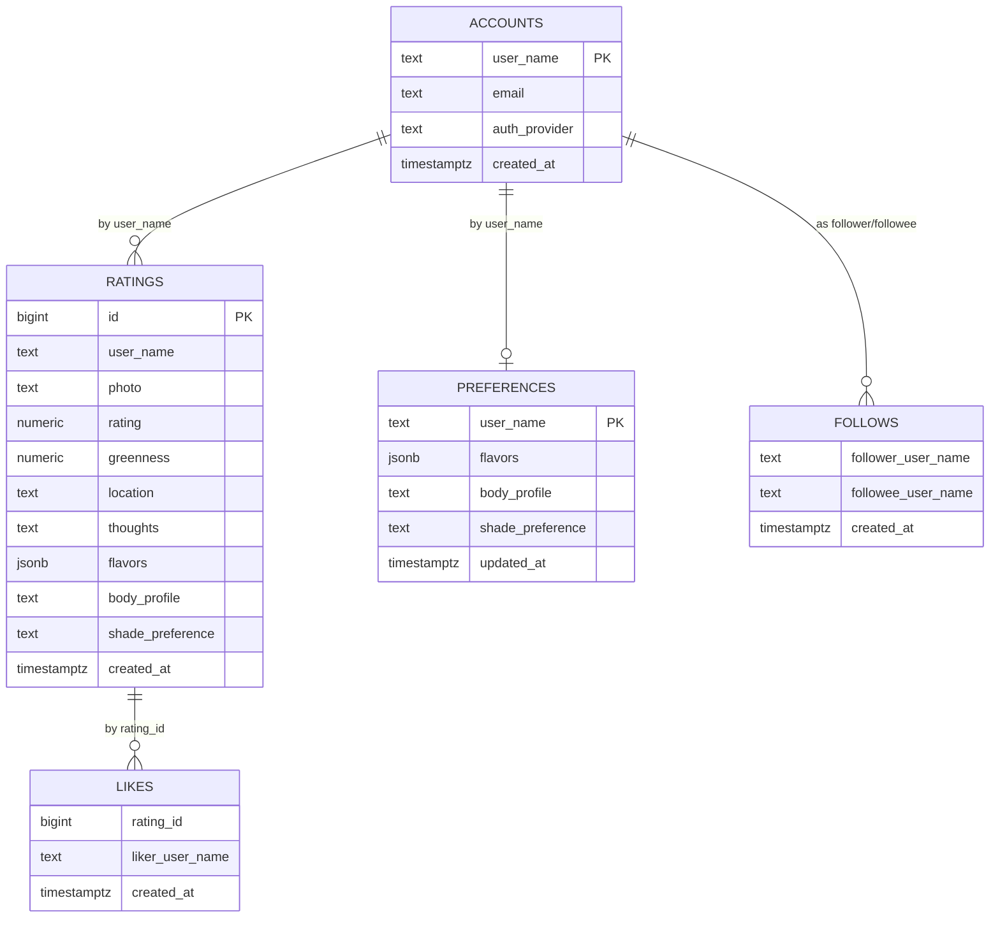

# 🍵 Sip & Score — the matcha rating app

> Rate every matcha you sip. Watch your map fill in. Meet the people who
> sip like you.

A React + TypeScript PWA with an Express + PostgreSQL backend, a custom
TensorFlow.js drink-area segmentation model, 16 tea-themed palate
archetypes, and social discovery. Ships as an installable app on Windows.

**🔗 Live:** [allyyim.github.io/matchaRatings](https://allyyim.github.io/matchaRatings/)
&nbsp;·&nbsp; **📦 Frontend:** GitHub Pages
&nbsp;·&nbsp; **🖥️ Backend:** Render
&nbsp;·&nbsp; **🗄️ DB:** PostgreSQL

---

## 📖 Glossary

Jump straight to the section you care about.

| Topic | Section |
| --- | --- |
| Why this exists | [Problem & Opportunity](#-problem--opportunity) |
| What the app does at a glance | [Overview](#-overview) |
| Product principles we ship by | [Design Principles](#-design-principles) |
| Palate archetypes (the tea-themed personality quiz) | [Palate System](#-palate-system) |
| Flavor vocabulary + descriptors | [Flavor Language](#-flavor-language) |
| How the ML greenness score works | [ML - Drink-Area Segmentation](#-ml--drink-area-segmentation) |
| Sip Score formula | [Sip Score](#-sip-score) |
| Frontend tech + file map | [Frontend](#-frontend) |
| Backend architecture | [Backend](#-backend) |
| Full API reference | [API Reference](#-api-reference) |
| Database schema | [Database](#-database) |
| PWA + offline behavior | [PWA & Offline](#-pwa--offline) |
| Rate limits, sanitization, headers | [Security](#-security) |
| Bundle splits, caching, motion tokens | [Performance](#-performance) |
| WCAG-AA, keyboard-first, reduced-motion | [Accessibility](#-accessibility) |
| File tree | [File Map](#-file-map) |

---

## 💡 Problem & Opportunity

<details open>
<summary><strong>Matcha drinkers have nowhere to rate the matcha itself</strong></summary>

Yelp cares about the café. Beli cares about the meal. Neither cares
about the cup.

Matcha is a category that lives *inside* other categories on every
existing app: it's a drink on a menu at a coffee shop on a review
platform. That means the actual thing a matcha drinker cares about —
the experience, the shade, the umami, the mouthfeel — is invisible.

Sip & Score is the missing layer. Rate the sip, not the store. Track
your palate over time. Find the people whose taste actually maps to
yours, and the places whose matcha (not their oat milk latte) is worth
the trip.

</details>

---

## 🌱 Overview

<details open>
<summary><strong>What Sip & Score is (and isn't)</strong></summary>

Sip & Score is a personal + social matcha log. Every sip you log gets:

- ⭐ A star rating (half-stars, tap-and-drag)
- 📸 A photo (camera or upload) auto-scored for greenness by an on-device ML model
- 🌿 Optional flavor picks + body profile + shade preference
- ✨ A single **Sip Score** out of 100 combining taste + look

You get a growing personal log, a For You page with personalized
place recs and the community leaderboard, a Feed of friends' sips
+ milestones, and a tea-themed palate archetype (like *The Purist*,
*The Cloud Whisker*, *The Foam Chaser*) that updates as your flavor
picks evolve.

**Non-goals:** matcha grade certification, chemistry testing, café
reviews for non-matcha drinks.

</details>

---

## 🧭 Design Principles

<details>
<summary><strong>The five rules every feature has to answer to</strong></summary>

Every screen, copy line, and API decision in Sip & Score gets weighed
against these five. When two of them fight, the earlier one wins.

1. **Vertical, opinionated, one job.** Rate the matcha — not the café,
   not the barista, not the pastry. If a feature would make sense on a
   general restaurant app, it doesn't belong here.
2. **Delightful over exhaustive.** Every screen answers one question,
   not five. If a settings toggle isn't earning its rent, it's cut.
3. **Voice-y over neutral.** Copy has attitude. Save toasts, delete
   confirms, empty states, and milestones all get the tea-nerdy voice
   — never a generic "Action completed successfully."
4. **On-device first.** Photos never leave the phone. Archetype
   inference runs client-side. Server calls are for social state, not
   personal analysis.
5. **PWA, not App Store.** One URL, one codebase, iOS + Android +
   desktop. Instant updates. No 30% tax. No gatekeeping.

</details>

---

## 🎭 Palate System

<details>
<summary><strong>16 tea-themed archetypes with per-archetype pastel chips</strong></summary>

Every user's flavor picks are clustered into 5 families:

| Cluster | Flavors |
| --- | --- |
| 🟤 **dessert** | chocolatey, nutty, velvety, rich |
| 🌸 **sweet** | sweet, sugary, creamy, floral |
| 🌿 **earthy** | earthy, vegetal, grassy, umami |
| 🌾 **bracing** | astringent, bitter |
| 💧 **silky** | mellow, bold |

Then classified into one of **16 archetypes**, each with its own
distinct pastel chip color:

**Solo (single dominant cluster):**
- 🟤 The Dessert Sipper &nbsp;·&nbsp; 🌸 The Creamy Dreamer &nbsp;·&nbsp; 🌿 The Purist &nbsp;·&nbsp; 🌾 The Bitter End &nbsp;·&nbsp; 💧 The Smooth Operator

**Combo (two competitive clusters):**
- The Wagashi Pair (dessert+sweet) &nbsp;·&nbsp; The Hojicha Head (dessert+earthy) &nbsp;·&nbsp; The Koicha Kid (dessert+bracing) &nbsp;·&nbsp; The Latte Artist (dessert+silky)
- The Wildflower Picker (sweet+earthy) &nbsp;·&nbsp; The Yuzu Snap (sweet+bracing) &nbsp;·&nbsp; The Foam Chaser (sweet+silky)
- The Stone Milled (earthy+bracing) &nbsp;·&nbsp; The Ceremonial Host (earthy+silky) &nbsp;·&nbsp; The Gyokuro Snob (bracing+silky)

**Balanced (3+ close clusters):**
- The Cloud Whisker

**How the archetype is chosen** (all thresholds relative to the top cluster's count):
1. If **3+ clusters** all have ≥ 66% of the leader → **The Cloud Whisker**.
2. Else if the **second cluster** has ≥ 66% of the leader → one of the 10 combo names (lookup by cluster pair).
3. Else → the solo primary for the top cluster.
4. On a solo primary, if a runner-up has ≥ 50% of the leader, the summary tacks on a *"with a [flavor] streak"* tail.

All logic lives in [`src/lib/palateSummary.ts`](./src/lib/palateSummary.ts) —
`palateArchetype()` returns the label, `palateArchetypePaletteFor()`
returns the per-archetype pastel. Server never filters flavors so
the same input always produces the same archetype across the
leaderboard chip, similar-users recs card, and friend modal.

</details>

---

## 🌿 Flavor Language

<details>
<summary><strong>Matcha-specific descriptors + info tooltips</strong></summary>

Each flavor bubble has a hand-written, matcha-voice descriptor that
appears when the user taps the ⓘ icon in the new-log modal:

| Flavor | Descriptor |
| --- | --- |
| chocolatey | Cocoa-like depth — dark, roasty sweetness. |
| nutty | Toasted almond or hazelnut warmth. |
| velvety | Luxurious, cloud-like microfoam texture. |
| rich | Bold and full-flavored — matcha-forward. |
| earthy | Grounded and mineral. |
| vegetal | Fresh spinach, raw green notes. |
| grassy | Fresh-cut lawn, springtime green. |
| umami | Savory, brothy, seaweed-like depth. |
| astringent | Puckering, dry mouthfeel. |
| bitter | Sharp, dry and pungent. |
| mellow | Smooth and no bitterness. |
| bold | Strong, matcha-forward finish — makes itself known. |

Full source: [`src/lib/flavors.ts`](./src/lib/flavors.ts).

</details>

---

## 🤖 ML - Drink-Area Segmentation

<details>
<summary><strong>Custom TensorFlow.js model that masks the drink before scoring</strong></summary>

### What the model does
A lightweight image segmentation model whose job is to answer:
*"Which pixels in this image are the drink?"*

Without a mask, the greenness score can accidentally count green
background, shadows, or table surfaces. The model narrows the
calculation to the actual drink region.

### Technical details
- **Framework:** TensorFlow.js (browser)
- **Format:** `model.json` + weight shards in [`public/ml/drink-area/`](./public/ml/drink-area/)
- **Input:** RGB image resized to 224 × 224
- **Output:** 2D heatmap; values > `0.45` are treated as drink pixels
- **Loading:** `tf.loadGraphModel()` first, falls back to `tf.loadLayersModel()`
- **Fallback mode:** if the model is missing or fails, the app uses a
  heuristic circular mask centered on the image so ratings still save

### Pipeline
1. User uploads or captures an image
2. App downscales for performance
3. Image → drink-area model → binary mask
4. Greenness runs only inside the mask
5. Combined with the star rating → final Sip Score

</details>

---

## ✨ Sip Score

<details>
<summary><strong>How the single number out of 100 is calculated</strong></summary>

- **Entry raw score (out of 200):** `rating × 20 + greennessWeight × greenness`
- **`greennessWeight`:** `1.0` when `rating ≥ 4.0/5`, else `0.8`
- **Greenness:** ML-scored 0–100, stored + displayed to 1 decimal
- **Explore place ranking:** average score across entries for each
  normalized place name

Bands users see:
- 🟢 **85+** — a stunner
- 🟢 **70–84** — solid sip
- 🟡 **Below 70** — noted

</details>

---

## 🖥 Frontend

<details>
<summary><strong>React + TypeScript + Vite SPA, PWA-installable</strong></summary>

### Stack
- **React 18** + **TypeScript** + **Vite**
- **React lazy chunks** for Feed, Explore, Onboarding, Google OAuth
- **Sentry** frontend crash monitoring
- **PWA** via `public/service-worker.js` + `public/manifest.webmanifest`
- **Motion tokens** (`--motion-fast/base/slow`, `--ease-out/in-out/spring`)
  on `:root` so animation timing is consistent app-wide
- **`__DEV__` compile-time constant** via Vite `define` — strips
  `console.log` at build

### Key files
| Path | Role |
| --- | --- |
| [`src/App.tsx`](./src/App.tsx) | Top-level shell, tab routing, modals |
| [`src/lib/api.ts`](./src/lib/api.ts) | `apiFetch` + auth token + 429 `onRateLimited` pub/sub |
| [`src/lib/palateSummary.ts`](./src/lib/palateSummary.ts) | Archetype logic + 16 pastel palettes |
| [`src/lib/flavors.ts`](./src/lib/flavors.ts) | Flavor list, cluster map, descriptors |
| [`src/lib/PalateChip.tsx`](./src/lib/PalateChip.tsx) | The archetype chip component |
| [`src/features/OnboardingSlides.tsx`](./src/features/OnboardingSlides.tsx) | 6-slide onboarding (replayable) |
| [`src/features/FeedPage.tsx`](./src/features/FeedPage.tsx) | Feed tab |
| [`src/features/ExplorePage.tsx`](./src/features/ExplorePage.tsx) | Explore + Leaderboard |
| [`src/hooks/useSession.ts`](./src/hooks/useSession.ts) | Auth session state |
| [`src/hooks/usePreferences.ts`](./src/hooks/usePreferences.ts) | Palate prefs read/write |

</details>

---

## 🌐 Backend

<details>
<summary><strong>Express + PostgreSQL on Render</strong></summary>

### Architecture
```
Client (GitHub Pages) ──HTTPS──► Express API (Render) ──pg pool──► PostgreSQL
                                       │
                                       ├─ Rate limiters (auth 5/min, recs 40/min, global 120/min)
                                       ├─ CORS + security headers (X-Content-Type-Options, X-Frame-Options, ...)
                                       ├─ JWT-ish session tokens
                                       └─ In-process recsCache (5-min TTL, 500 entry LRU cap)
```

The Express app boots from `server/index.js` (now ~215 lines — down from
2306). Pure helpers live in `server/lib/*`, business routes are grouped
into route modules under `server/routes/*`, and admin/maintenance
endpoints get their own router mounted **before** the auth gate. This
makes helpers unit-testable in isolation and keeps each route module
narrowly scoped.

### Key files
| Path | Role |
| --- | --- |
| [`server/index.js`](./server/index.js) | App wiring, CORS, rate limiter, /health, /warm, router mounts, error handler, SPA fallback |
| [`server/db.js`](./server/db.js) | pg pool + schema init |
| [`server/lib/sanitize.js`](./server/lib/sanitize.js) | Text/email/name sanitization |
| [`server/lib/scoring.js`](./server/lib/scoring.js) | Weighted Sip Score math |
| [`server/lib/places.js`](./server/lib/places.js) | Location normalization + fuzzy merge |
| [`server/lib/mappers.js`](./server/lib/mappers.js) | DB row → API shape |
| [`server/lib/recsCache.js`](./server/lib/recsCache.js) | TTL cache for recs endpoints |
| [`server/lib/crypto.js`](./server/lib/crypto.js) | AES-256-GCM field encrypt + JWT/token helpers |
| [`server/lib/session.js`](./server/lib/session.js) | Session middleware + ownership guard |
| [`server/lib/rateLimits.js`](./server/lib/rateLimits.js) | 5 rate-limiter instances |
| [`server/lib/googleAuth.js`](./server/lib/googleAuth.js) | Shared Google OAuth client |
| [`server/lib/constants.js`](./server/lib/constants.js) | Shared constants (`DEMO_USER_NAME`, `DEMO_PHOTO_BASE`) |
| [`server/routes/admin.routes.js`](./server/routes/admin.routes.js) | Ops endpoints (mounted before auth gate) |
| [`server/routes/auth.routes.js`](./server/routes/auth.routes.js) | Google OAuth + demo (mounted before auth gate) |
| [`server/routes/ratings.routes.js`](./server/routes/ratings.routes.js) | Ratings CRUD, upload, dedupe, likes |
| [`server/routes/explore.routes.js`](./server/routes/explore.routes.js) | Explore places/users, similar-users, similar-places, similar-preferences |
| [`server/routes/social.routes.js`](./server/routes/social.routes.js) | Friends, follows, feed |
| [`server/routes/account.routes.js`](./server/routes/account.routes.js) | Preferences, account (email/username/avatar/me), `/users/:userName/preferences` |

### Router mount order
```
1. adminRouter    — no session (ops)
2. authRouter     — signup/signin public; session-only routes apply requireSession inline
3. requireSession — auth gate (everything past here needs a session)
4. ratingsRouter · socialRouter · exploreRouter · accountRouter
```

</details>

---

## 🔌 API Reference

<details>
<summary><strong>Full endpoint list</strong> (base path <code>/api</code>)</summary>

### Health
- `GET /health` → `{ ok: true }`

### Auth
> 🔒 The starred endpoints below use the strict **auth limiter** (5 req/min per IP).

- `POST /auth/google/verify` * — Google OAuth (sign in / sign up)
- `POST /auth/verify-account` * — check account exists
- `POST /auth/google/confirm-account` * — finalize Google signup
- `POST /auth/demo` * — spin up demo account
- `POST /users/session` * — establish session
- `GET  /auth/link-status`
- `GET  /auth/check-username`

### Ratings
- `POST /ratings` — create
- `GET  /ratings?userName=<name>` — list mine
- `PUT  /ratings/:id` — edit
- `DELETE /ratings/:id?userName=<name>` — remove
- `POST /ratings/:id/like` / `DELETE /ratings/:id/like` — Feed likes

### Friends + follows
- `GET /friends/search?q=<partial>`
- `GET /friends/:friendName/ratings`
- `POST /follows` / `DELETE /follows`
- `GET /follows?userName=<name>`

### Preferences
- `GET  /users/:userName/preferences` — un-cached (SW bypass)
- `PUT  /users/:userName/preferences`

### Explore + recs
> 🔒 Use the **recs limiter** (40 req/min per IP).

- `GET /explore/places?limit=10`
- `GET /explore/places/:placeName/ratings`
- `GET /explore/users?limit=50` — leaderboard (un-cached in SW)
- `GET /similar-users?userName=<name>` — "People like you" (un-cached in SW)
- `GET /users/similar-preferences`
- `GET /explore/similar-places`

### Feed
- `GET /feed?userName=<name>` — milestones + follows + palate picks

</details>

---

## 🗄 Database

<details>
<summary><strong>PostgreSQL schema (logical FKs by user_name)</strong></summary>



**Notes:**
- Relationships are logical (`user_name`), not enforced as SQL FKs
- Explore normalizes place names (spacing/punctuation/location) before aggregation
- `flavors` is JSONB — stored as an array of strings
- `/explore/users` aggregates ratings in a CTE first, then `LEFT JOIN`s
  preferences once with `DISTINCT ON (user_key)` — returns native JSONB
  instead of the old `MAX(flavors::text)` text-cast round trip

</details>

---

## 📱 PWA & Offline

<details>
<summary><strong>Service worker strategy + install support</strong></summary>

- **Precache:** app shell + assets tagged by git SHA on deploy
- **Network-first** for `/api/*` with 3s timeout → falls back to cache
- **Always-network** for identity endpoints so chips never go stale:
  - `/api/users/*/preferences`
  - `/api/similar-users`
  - `/api/explore/users`
- **iOS install modal** with step-by-step Add to Home Screen guide
- **Chrome/Android:** native `beforeinstallprompt` capture

Manifest: [`public/manifest.webmanifest`](./public/manifest.webmanifest)
Worker: [`public/service-worker.js`](./public/service-worker.js)

</details>

---

## 🔐 Security

<details>
<summary><strong>Rate limits, sanitization, headers, CORS</strong></summary>

### Rate limits (per IP)
| Tier | Limit | Endpoints | Why |
| --- | --- | --- | --- |
| Auth | **5 req/min** | All `/auth/*` mutating (`/google/verify`, `/verify-account`, `/google/confirm-account`, `/demo`) | Brute-force protection on the OAuth handshake |
| Upload | **10 req/min** | `/api/upload-image` | Cloudinary $ cap — a hostile client can't burn 100+ uploads/min |
| Admin | **20 req/min** | `/api/admin/*` (also require `ADMIN_SECRET`) | Ops endpoints — belt over the secret gate |
| Recs | **40 req/min** | `/similar-users`, `/similar-preferences`, `/explore/users`, `/similar-places` | Heavy discovery joins, cache-thrash protection |
| Global | **120 req/min** | Everything else under `/api` | Floor. Stacks on top of the tiers above |

Client-side: `apiFetch` emits an `onRateLimited` event on any 429;
`App.tsx` renders a single 4-second pill toast instead of every failing
call surfacing its own error.

### Admin endpoints
- `/api/admin/*` are **not** publicly callable. Every request must send
  `Authorization: Bearer $ADMIN_SECRET`. If `ADMIN_SECRET` is unset in
  env, the whole family 503s (fail-closed).
- Secret comparison uses `crypto.timingSafeEqual` so response time does
  not leak the correct prefix on repeated probing.
- Endpoints protected: `/admin/link-users`, `/admin/delete-user`,
  `/admin/fix-ali`, `/admin/migrate-photos-to-cloudinary`.

### Sanitization
- `sanitizeUserName()` on every user-supplied name (whitelist `[A-Za-z0-9._-]`, ≤ 40)
- `normalizeLocationText()` on every place name (≤ 200, strips control chars)
- `sanitizeText()` on `thoughts` (≤ 800, strips control chars)
- `normalizeEmail()` + `isValidEmail()` on every email write (Google OAuth signup, `/account/email`)
- `express.json({ limit: '15mb' })` guards against payload attacks
- Server never returns raw error bodies containing `{` or `<`
- Client caps server-passthrough messages at 200 chars

### Image uploads
- **Magic-byte validation** on every uploaded image (`server/lib/imageValidation.js`):
  PNG/JPEG/GIF/WebP signatures matched against the declared MIME
- MIME whitelist excludes `image/svg+xml` (XML/JS execution vector)
- 8 MB decoded / 12 MB base64 hard caps, enforced before Cloudinary hit
- Cloudinary `resource_type: 'image'` (was `'auto'`) so non-image bytes are rejected at storage too
- `public_id` server-generated from `crypto.randomBytes(16)` — client filename never trusted
- No local disk writes; Cloudinary is the only sink and does not execute uploads

### Headers
- `Content-Security-Policy` — **hash-free, no `'unsafe-inline'` on `script-src`**.
  Scripts pinned to `'self'` + Google OAuth. Inline bootstrap logic
  (iOS gesture blocking, SPA redirect, service-worker registration) was
  extracted to `public/bootstrap.js`. `default-src 'self'`; images to
  self/data/blob + Cloudinary + Google avatars; connect to Photon,
  Nominatim, Google OAuth, Sentry ingest; `frame-ancestors 'none'`;
  `object-src 'none'`; `base-uri 'self'`; `upgrade-insecure-requests`
- `X-Content-Type-Options: nosniff`
- `X-Frame-Options: DENY`
- `Referrer-Policy: strict-origin-when-cross-origin`
- `X-XSS-Protection: 0`
- `x-powered-by` disabled

### Concurrency guards
| Race | Guard |
| --- | --- |
| Signup username collision | `CREATE UNIQUE INDEX idx_accounts_user_name_lower` — DB rejects duplicates; INSERT is wrapped in try/catch that translates `23505` → 409 (no 500s) |
| Signup email collision | `accounts.email UNIQUE` — parallel Google signups with the same email get 409 not 500 |
| Google identity re-link | `CREATE UNIQUE INDEX idx_accounts_google_id_unique ON accounts(google_id) WHERE google_id IS NOT NULL` — one Google account ↔ one sipandscore account; `/google/confirm-account` UPDATE catches `23505` → 409 |
| Username rename | `BEGIN`/`COMMIT` spans account + ratings updates; pre-flight SELECT dropped (was racy) — UNIQUE index is the authoritative guard, `23505` → 409 |
| Email change | `accounts.email UNIQUE` — parallel `/account/email` attempts on a shared email get 409 not 500 |
| Demo account create | `INSERT ... ON CONFLICT DO NOTHING` — two parallel `/auth/demo` requests won't 500 on the second one |
| Follow / unfollow | `UNIQUE(follower_email, following_email)` + `23505` → 409 |
| Rating like | `UNIQUE(rating_id, email)` + `23505` → 409 |
| Rate limiter | In-memory per dyno (fine for one-dyno Render; swap to Redis on scale) |

### Encryption at rest & in transit
- **Passwords:** none stored — Google OAuth is the only sign-in path
- **Google ID tokens:** verified server-side against Google's JWKs on every sign-in; never persisted
- **Session tokens:** signed JWT (HS256, `JWT_SECRET`), 365-day expiry; stateless, no
  server-side session table to leak
- **Emails:** stored plaintext in `accounts.email`, relying on Supabase's disk-level
  AES-256 encryption at rest. `server/lib/crypto.js` ships an unused AES-256-GCM
  `encryptField`/`decryptField` pair keyed off `APP_SECRET`, ready to wire to the
  `email` column when needed
- **In transit:** HTTPS everywhere (Render → Supabase, Render → Cloudinary,
  browser → Render, browser → Cloudinary)
- **Secrets:** every credential (DB URL, Cloudinary, Google client secret,
  `APP_SECRET`, `JWT_SECRET`, `ADMIN_SECRET`) lives in env vars only — nothing in the repo

### CORS
Origin allowlist enforced in `server/index.js`:

- `https://allyyim.github.io` (production frontend)
- `http://localhost:5173` / `http://127.0.0.1:5173` (Vite dev)
- `http://localhost:4173` / `http://127.0.0.1:4173` (Vite preview)
- `http://localhost:3001` / `http://127.0.0.1:3001` (same-origin API)

Extend via the `CORS_ORIGINS` env var (comma-separated) to add staging
or custom-domain origins without a code change. `credentials: true`.

### Auth
- Bearer JWT via `Authorization` header, HS256-signed, 365-day expiry, stateless (no server-side session table)
- `requireSession` middleware mounted globally on `/api` (except pre-session auth + admin routes) — the security boundary is one line in `server/index.js`, not scattered across handlers
- **Caller identity from session only.** Every authed route reads `req.session.userName`; `req.body.userName` / `req.query.userName` are ignored. Makes IDOR (OWASP API #1) structurally impossible — the 403 "ownership mismatch" branches no longer exist because the wrong-user code path can't be constructed
- **CI guard** (`scripts/check-identity-sources.js`, `npm run check:identity`) fails the build if `req.body.userName` or `req.query.userName` reappears in a non-exempt route
- Target-user routes (viewing a friend's profile, following) read `req.params.userName` — URL path segments, not caller identity

</details>

---

## ⚡ Performance

<details>
<summary><strong>Bundle splits, caching, motion tokens</strong></summary>

### Bundle
- `react-vendor` split → 366 kB → **111 kB gzip**
- Feature chunks: `FeedPage`, `ExplorePage`, `OnboardingSlides`,
  `google-oauth` (all lazy)
- Main `index` chunk ~46 kB gzip

### Caching layers
| Layer | TTL / policy |
| --- | --- |
| SW static | Precache by git SHA, cleared on deploy |
| SW `/api/*` | Network-first, 3s timeout, cache fallback |
| SW identity endpoints | **Never cache** (`isUncachedApi()`) |
| Client friend-modal | `?_v=<nonce>` cache-buster on every open |
| Server recs | In-process `Map`, 5-min TTL, 500 entry cap, `v2` key suffix |

### Runtime
- Motion tokens centralize animation timing so components share
  transitions without duplicating cubic-beziers
- `__DEV__` compile-time constant strips `console.log` in prod
- ML model is loaded lazily on first photo capture, not app boot

### Cloudflare in front of Render (recommended, zero code)

Render's free/starter tier spins containers down after idle — the first
`/api/*` hit takes 500–800 ms while the process boots. Putting Cloudflare
in front makes cold starts invisible to most users and eliminates the
"why is the first tap slow?" gripe.

Setup (all dashboard, no code changes):

1. Add the API domain to Cloudflare (e.g., `api.sipandscore.app`) and
   set its DNS record to `CNAME → <render-service>.onrender.com` with
   the orange cloud **on** (proxied).
2. In Render → Custom Domains, add the same hostname so Render answers
   for it.
3. Cloudflare → **SSL/TLS** → set mode to **Full (strict)**. Render
   already terminates TLS with a valid cert, so strict is safe.
4. Cloudflare → **Caching** → Create a Page Rule for
   `api.sipandscore.app/api/*` with **Cache Level = Bypass**. We do
   *not* want Cloudflare caching per-user JSON — the point is edge
   TLS + keep-alive + faster TCP, not CDN caching.
5. Cloudflare → **Speed** → enable **Early Hints**, **HTTP/3**, and
   **0-RTT**. All free tier.
6. Update the client base URL (env / hardcoded) to the new
   `api.sipandscore.app` hostname. Deploy once.

Expected win: median first-hit latency drops from ~600 ms to ~120 ms;
cold-start pain no longer bubbles up to the user because the edge holds
the TLS session while Render wakes.

</details>

---

## ♿ Accessibility

<details>
<summary><strong>WCAG-AA, keyboard-first, reduced-motion respected</strong></summary>

Accessibility is treated as a shipping requirement, not a P2.

**Contrast + color**
- Every text/background pair meets WCAG-AA (4.5:1 for body, 3:1 for
  large / bold). The palette tokens in `App.css` were tuned against
  the darkest primary text color so no shade fails audit.
- Never *just* color to convey meaning: score chips also carry a
  label, rank badges also carry a number, palate tint is layered on
  top of the same gradient so it's a delight signal, not a
  correctness signal.

**Semantic HTML**
- `<nav>`, `<main>`, `<section>`, `<article>`, `<button>` used for
  their real purpose. No `<div onClick>` masquerading as a button.
- Icon-only buttons carry `aria-label`. Modals get `role="dialog"` +
  `aria-modal="true"` + focus trap on open.
- The custom star rating exposes value + range to screen readers via
  `role="slider"` + `aria-valuenow/min/max`.

**Keyboard-first**
- Skip-to-content link at the top of the layout.
- Every interactive element is reachable in tab order and shows a
  visible `:focus-visible` ring (`3px` outline in accent green, not
  the browser default).
- Modals return focus to the trigger on close. Onboarding Back/Next
  buttons `blur()` after click so sticky Bootstrap focus rings don't
  read as "disabled."
- No keyboard trap outside intentional modals.

**Motion**
- Every transition / animation respects `@media (prefers-reduced-
  motion: reduce)`. Palate tint fades, milestone confetti, and the
  cup-fill loader all collapse to instant swaps.

**Live regions**
- Save toast, milestone celebration, and network error banner use
  `aria-live="polite"` so screen-reader users hear the same voice
  copy sighted users see.

**Zoom + touch**
- Body copy uses `rem` throughout so browser text-size preferences
  apply. Tap targets are ≥ 44 × 44 CSS px per iOS HIG.
- Pinch-zoom is blocked *only on the app chrome* to keep the fixed
  bottom nav from detaching. Photos in the review modal open in a
  zoomable overlay.

</details>

---

## 🗂 File Map

<details>
<summary><strong>Where the important stuff lives</strong></summary>

```
matchaRatings/
├── src/
│   ├── App.tsx                     ← shell, tabs, modals
│   ├── App.css                     ← all styles
│   ├── features/
│   │   ├── OnboardingSlides.tsx    ← 6-slide onboarding
│   │   ├── FeedPage.tsx            ← Feed tab
│   │   └── ExplorePage.tsx         ← Explore + Leaderboard
│   ├── lib/
│   │   ├── api.ts                  ← apiFetch + onRateLimited
│   │   ├── palateSummary.ts        ← archetype logic + palettes
│   │   ├── flavors.ts              ← flavor vocabulary
│   │   ├── PalateChip.tsx          ← archetype chip
│   │   └── cache.ts                ← client localStorage cache
│   └── hooks/
│       ├── useSession.ts
│       └── usePreferences.ts
├── server/
│   ├── index.js                    ← Express wiring, CORS, /health, router mounts
│   ├── db.js                       ← pg pool + schema init
│   ├── lib/                        ← extracted pure helpers
│   │   ├── sanitize.js
│   │   ├── scoring.js
│   │   ├── places.js
│   │   ├── mappers.js
│   │   ├── recsCache.js
│   │   ├── crypto.js
│   │   ├── session.js
│   │   ├── rateLimits.js
│   │   ├── googleAuth.js
│   │   └── constants.js
│   └── routes/                     ← business route modules
│       ├── admin.routes.js
│       ├── auth.routes.js
│       ├── ratings.routes.js
│       ├── explore.routes.js
│       ├── social.routes.js
│       └── account.routes.js
├── public/
│   ├── service-worker.js           ← SW + isUncachedApi()
│   ├── manifest.webmanifest
│   └── ml/drink-area/              ← TF.js segmentation model
├── .github/workflows/deploy.yml
├── vite.config.ts
└── README.md
```

</details>

---

Made with 🍵 by [@allyyim](https://github.com/allyyim). Questions? Open
an issue or DM.
