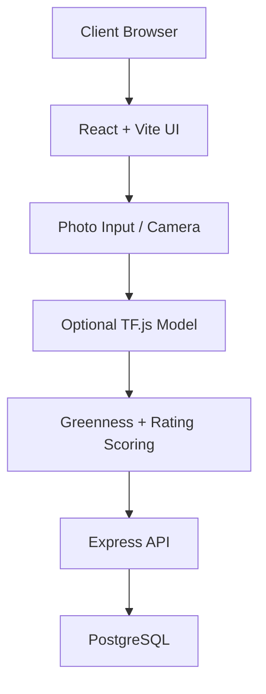
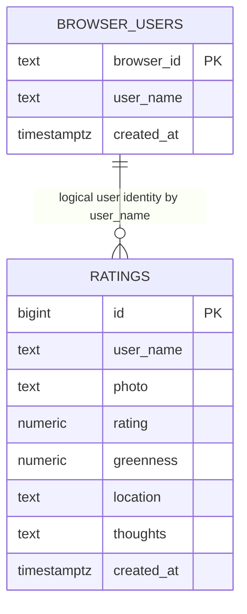

# Sip & Score - Matcha Log

React + TypeScript + Vite app for rating matcha with half-star support, tap-and-drag star input, camera capture, optional ML drink-area detection, friend lookups, and Explore rankings.

<details open>
<summary><strong>Technical Design</strong></summary>

This project uses a split frontend/backend architecture.

- Frontend: React + TypeScript SPA (`src/App.tsx`) built with Vite.
- Backend: Express API (`server/index.js`) serving JSON endpoints.
- Data: PostgreSQL via `pg` pool (`server/db.js`).
- ML assist: A custom TensorFlow.js drink-area segmentation model in `public/ml/drink-area/model.json` that finds the cup/liquid in the photo before measuring green pixels inside that region.
- Monitoring: Free Sentry tier for frontend + backend crash monitoring and release tracking.
- Release tagging: GitHub Releases should include a version tag like `v1.0.0` and match the app release value used in Sentry.
- Scoring:
  - Entry total score (out of 200): `rating * 20 + greennessWeight * greenness`
  - `greennessWeight = 1.0` when rating is `4.0/5` or higher, otherwise `0.8`
  - Greenness is stored and displayed to one decimal place.
  - Explore place ranking: average score out of 200 across entries for each normalized place.



</details>

<details open>
<summary><strong>ML Model: Drink-Area Segmentation</strong></summary>

The app uses a custom TensorFlow.js model to estimate where the drink sits inside the photo before measuring green intensity.

### What the machine learning is doing
This is not a model that guesses taste or quality. It is a lightweight image segmentation model whose job is to answer:

- “Which pixels in this image are likely part of the drink?”
- “Which pixels are background, cup edge, table, or other objects?”

This matters because the app is not trying to score the whole photo. It only wants to measure the drink itself.

The segmentation mask is then used to restrict greenness analysis to the actual drink region instead of counting green background, shadows, table surfaces, or cup edges.

### What “greenness” means
Greenness is a visual proxy score for how much the drink looks like matcha, not a scientific matcha test.

The app computes a score based on:

- how much of the drink region is green
- how saturated or vivid that green is
- how much of the drink area is matcha-like instead of neutral/white/brown

It is a rough estimate of “does this look like a vibrant green matcha drink?” on a scale from 0 to 100.

This is intentionally a simple visual feature, not a chemistry assay or a lab-quality metric. It helps rank photos relative to each other, while the user still decides the final taste rating.

### Model technical details
- Framework: TensorFlow.js
- Model format: `model.json` + weight shards in `public/ml/drink-area/`
- Input: RGB image, resized to `224 x 224`
- Output: a mask tensor that resolves to a 2D heatmap of the drink region
- Threshold: mask values above `0.45` are treated as drink pixels
- Runtime loading: `tf.loadGraphModel(...)` first, then `tf.loadLayersModel(...)` as a fallback
- Fallback mode: if the model is missing, incompatible, or fails at runtime, the app falls back to a heuristic circular mask centered on the image

### Why this is useful
Without a region mask, the green-score calculation can accidentally count green background, shadows, table surfaces, or cup edges. The model narrows the greenness calculation to the actual drink area, which makes the score more stable and more aligned with what a human would call “matcha green.”

### Processing pipeline
1. User uploads or captures an image.
2. The app lightly downscales it for performance.
3. The image is passed into the drink-area model.
4. A binary mask is generated for drink pixels.
5. Greenness analysis runs only inside that mask.
6. The final score is combined with the star rating to produce the overall entry score.

### Failure behavior
If the model is unavailable or inference fails, the app keeps working by falling back to the heuristic region detector and still allows the user to save a rating without a photo.

</details>

<details open>
<summary><strong>System Design</strong></summary>

### Runtime Components

- `src/App.tsx`: page tabs (`My Log`, `Friends Ratings`, `Explore`), rating creation/edit/delete, tap-and-drag star input, search, and overlays.
- `server/index.js`: REST routes for sessions, ratings CRUD, friend search/lookups, explore places, and explore users.
- `server/db.js`: DB pool + schema initialization.

### Database Relations



Notes:
- The relationship is logical (by user name), not enforced as a SQL foreign key.
- Explore endpoints normalize and merge similar place names before aggregation, including spacing, punctuation, and location variants.

</details>

<details open>
<summary><strong>API Calls</strong></summary>

Base path: `/api`

### Health and Session

- `GET /health`
  - Response: `{ ok: true }`
- `POST /users/session`
  - Body: `{ browserId, userName? }`
  - Response: `{ requiresName, userName? }`

### Ratings

- `POST /ratings`
  - Body: `{ userName, photo, rating, greenness, location, thoughts }`
  - Response: `{ rating }`
- `GET /ratings?userName=<name>`
  - Response: `{ ratings: RatingEntry[] }`
- `PUT /ratings/:id`
  - Body: `{ userName, rating, location, thoughts, greenness? }`
  - Response: `{ rating }`
- `DELETE /ratings/:id?userName=<name>`
  - Response: `{ deletedId }`

### Friends

- `GET /friends/search?q=<partialName>`
  - Response: `{ friends: string[] }`
- `GET /friends/:friendName/ratings`
  - Response: `{ friendName, ratings: RatingEntry[] }`

### Explore

- `GET /explore/places?limit=10`
  - Response: `{ places: [{ rank, placeName, averageScore, entryCount }] }`
- `GET /explore/places/:placeName/ratings`
  - Response: `{ placeName, ratings: RatingEntry[] }`
- `GET /explore/users?limit=50`
  - Response: `{ users: [{ userName, placeCount }] }`

</details>

<details>
<summary><strong>Local Development</strong></summary>

1. Install dependencies:

```bash
npm install
```

2. Copy env template and set DB connection:

```bash
copy .env.example .env
```

3. Start frontend + backend:

```bash
npm run dev:full
```

4. Open the Vite URL (usually `http://localhost:5173`).

Optional split runs:

```bash
npm run dev
npm run server
```

</details>

<details>
<summary><strong>Build and Deploy</strong></summary>

Build:

```bash
npm run build
```

Preview:

```bash
npm run preview
```

GitHub Pages deploys from `main` via GitHub Actions.

</details>

<details open>
<summary><strong>FAQ </strong></summary>

### 1) How does the app know a new user is registering?
The app sends `browserId` to `POST /api/users/session`. If no existing `browser_users` row exists for that browser and no name is provided, API returns `requiresName: true`, and the UI prompts for a name.

### 2) What does the greenness score really mean?
In plain English, the greenness score is a rough estimate of how much the drink in the photo looks like matcha.

It is not measuring quality, taste, nutrition, or chemistry. It is a visual proxy based on the photo: more vivid green, more coverage of the drink area, and a stronger matcha-like color all push the score higher.

Think of it like this:

- `0` = no obvious matcha green in the photo, or no photo was analyzed
- `25` = a little green is visible, but it is weak or patchy
- `50` = clearly green and matcha-like, but not especially intense
- `75` = strong green coverage and a rich matcha look
- `100` = extremely green and visually very matcha-like

The app uses this as a support signal, not as a perfect scientific test. It helps compare photos and adds a second dimension alongside your taste rating.

For rankings, the app combines the star rating and the green score together, with the green score weighted a bit less when the star rating is below `4` stars. In everyday terms: the app is rewarding both “how much you liked it” and “how green the drink looked.”

Explore place rankings use the average score out of 200 for each merged place.

### 3) How do the top 10 places in Explore get ranked?
Places are ranked by average score out of 200 across all user ratings. Duplicate entries for the same place are merged dynamically before ranking, including variants caused by punctuation, spacing, or appended city/location text. Results then sort highest to lowest by average score.

### 4) Can I click a place in Explore to see all ratings for it?
Yes. Click any place card in the `Top Places` list to open a popup modal with all ratings matched to that place (including merged name/location variants). Use the `X` button in the top-right of the popup to close it.

### 5) Is the camera always required?
No. You can upload from photo roll or capture live. After a photo is chosen/captured, live camera access is stopped.

### 6) How do star ratings work in the UI?
Ratings support half-stars and `0` stars. You can tap a star or press and drag across the star row in both the new-entry form and the edit-entry form.

### 7) Why must each username be unique?
The `browser_users` table enforces a UNIQUE constraint on `user_name`, so each username belongs to exactly one user. This prevents confusion in Friends search, keeps ratings correctly attributed, and ensures the app maintains a trustworthy social network.

</details>
